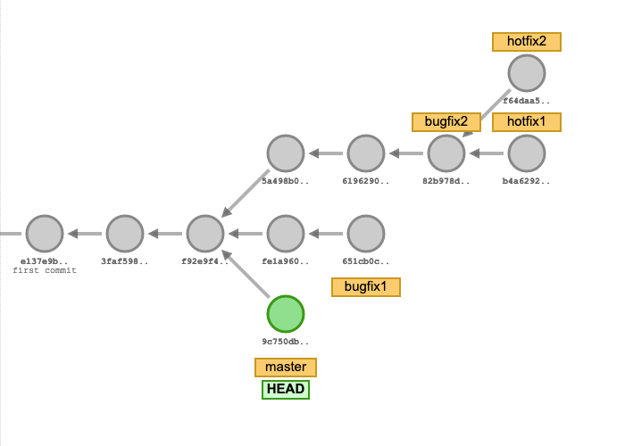

# Branches

Branches are a way to create a new line of development, they are pointers to a specific commit in the commit history.
Branches are refs that are automatically advanced to the latest commit in the branch. They are often used to separate
different features/areas of work that are unrelated to each other.

You can switch between branches at any time, this will change the state of your working directory to the state of the
branch you switched to. You can easily do this with the `git switch` command.

Branches are isolated from each other, this means that you can work on different features in parallel without needing to
interfere with each other.

There is always a default branch called `main`, this is the branch that is checked out when you clone a repository. This
branch is often used to represent the current state of the project, it is also often used to create releases. Services
like GitLab and GitHub allow you to protect this branch, this means that you can only merge changes into this branch if
a certain set of criteria is met, e.g. all tests must pass.

## Divergent Histories

What we just created is called a **divergent history**, this means that we created a new branch and committed a change
to it. The commit history of the `main` branch, your branch (`<name>/branches`) and the branch of the other participants
are now different from each other.

### Example



## Exercise

### Setup

Clone our example repository:

```bash
git clone https://git.mpi-cbg.de/scicomp/teaching/git-102-sandbox.git
```

### Tasks

1. Create a new branch called `<name>/branches` where `<name>` is your name, e.g. `alice/branches`

   ```bash,reveal
   git switch -c <name>/branches
   ```

2. How does the commit history look like? What can you spot?

   ```bash,reveal
   git log --oneline --graph --all
   ```

3. Create a new file called `<name>.txt` where `<name>` is your name, e.g. `alice.txt` and add the text `Hello World` to
   it.

   ```bash,reveal
   echo "Hello World" > <name>.txt
   ```

4. Commit your changes

   ```bash,reveal
   git add <name>.txt
   git commit -m "add <name>.txt"
   ```

5. How does the commit history look like?

   ```bash,reveal
   git log --oneline --graph --all
   ```

6. Edit the file `<name>.txt` and add one of your hobbies. (If you feel uncomfortable sharing this information, you can
   also add a random word) and commit the file.

   ```bash,reveal
   git add <name>.txt
   git commit -m "add hobby to <name>.txt"
   ```

7. How does the commit history look like?

   ```bash,reveal
   git log --oneline --graph --all
   ```

   As you can see, the commit history of the `main` branch and your branch are different from each other and your branch
   automatically moved forward.

8. Switch back to the `main` branch

   ```bash,reveal
   git switch main
   ```

9. Push your changes to the remote repository

   ```bash,reveal
   git push origin <name>/branches
   ```

10. Wait for everyone to get to this point

11. Fetch the changes from the remote repository

    ```bash,reveal
    git fetch origin
    ```

12. How does the commit history look like?

    ```bash,reveal
    git log --oneline --graph --all
    ```

## Branching Strategies

There are many different branching strategies, the most common ones are:

- [Feature Branching](#feature-branching)
- [Gitflow](#gitflow)
- [Trunk Based Development](#trunk-based-development)
- [Gitlab Flow](#gitlab-flow)
- [Github Flow](#github-flow)

### Feature Branching

Feature branching is a branching strategy where you create a new branch for every feature you want to implement. This is
a very common branching strategy and is used by many projects. The main advantage of this strategy is that you can work
on different features in parallel without needing to interfere with each other. The main disadvantage is that you need
to merge your changes back into the main branch, this can be a tedious task if you have many branches.

This also had the added benefit that you can easily see which features are currently being worked on and which features
are already finished, still missing or abandoned.

Due to the very nature of this strategy, the main branch is always in a working state.

### Gitflow

Gitflow is a branching strategy that is based on feature branching. It is a very common branching strategy and is used
by many projects, but has a significant overhead for small projects. The trend is to use simpler branching strategies,
like the aforementioned feature branching.

Gitflow is based on two main branches:

* `main` - This branch represents the current state of the project, it is often used to create releases.
* `develop` - This branch represents the current state of the development, it is often used to create releases.

Feature branches are branched off from the `develop` branch and merged back into the `develop` branch once they are
done.

When a release is ready, a new branch called `release/<version>` is created from the `develop` branch. This branch is
used to fix bugs and prepare the release, no new features are added in this branch. The `develop` branch now enters a
new development cycle and new features are added to it.
Once the release is ready, it is merged into the `main` branch and tagged with the version number. It is also merged
back into the `develop` branch.

This strategy is so popular that there are many tools that help you to automate this process.

### Trunk Based Development

Trunk Based Development is a branching strategy where you only have one branch, the `main` branch. This branch
represents the current state of the project. This strategy is very simple, but breaks down for larger projects. The main
advantage of this strategy is that you don't need to merge your changes back into the main branch, this can be a tedious
task if you have many branches, but is often used for small projects that are developed by a single person.

### Gitlab Flow

GitLab flow is a simpler alternative to Gitflow. It is based on feature branching, but only has one main branch.

Feature branches are branched off from the `main` branch and merged back into the `main` branch once they are done,
there are additional branches for `production` and `stable`.

Essentially teams practice feature branching, and once a release is ready it is merged into the `production` branch and
released. A repository can also opt into numbered releases, in this case a new branch is created for every release.

### Github Flow

Github flow is a simpler alternative to Gitflow. It is based on feature branching, but only has one main branch.

It is very similar to Gitlab flow, but it doesn't have a `production` branch. Instead, releases are created from
the `main` branch and tagged with the version number. Features are only merged through pull requests, which enables code
reviews.

### Merging Divergent Histories

Once you have developed your features/requirements you likely want to merge these changes back together. This is where
the concept of **merging** comes into play. Conceptually merging takes the state of the target branch and the current
branch and merges them together, changes of the target branch are applied to the current branch, resulting in a new
commit, unifying both branches, if both branches touched the same section of code conflict resolution must take place,
the chapter [merge](../01-actions/01-merge.md) goes into greater detail, but of the time these can be applied
automatically.

## Trivia

* The name of the default branch `main` is a reference to the `master` branch, which was the default branch name for a
  long time, but has been replaced by `main` due to its racist connotations.
* The `master` branch is still used in many projects, but it is slowly being replaced by `main`.
* Nowadays the default branch name is configurable, but `main` is the most common one. Some other common names
  are `develop` and `trunk`.

## Resources

- [Git Documentation](https://git-scm.com/book/en/v2/Git-Branching-Branches-in-a-Nutshell)
- [Atlassian Git Tutorial](https://www.atlassian.com/git/tutorials/using-branches)
- [Git Branching Strategies](https://www.atlassian.com/git/tutorials/comparing-workflows)
- [Gitflow](https://www.atlassian.com/git/tutorials/comparing-workflows/gitflow-workflow)
- [Trunk Based Development](https://trunkbaseddevelopment.com/)
- [Gitlab Flow](https://about.gitlab.com/topics/version-control/what-is-gitlab-flow/)
- [Github Flow](https://docs.github.com/en/get-started/quickstart/github-flow)
