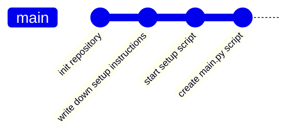
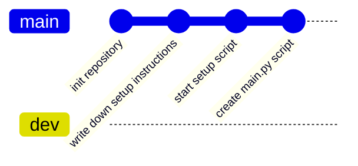
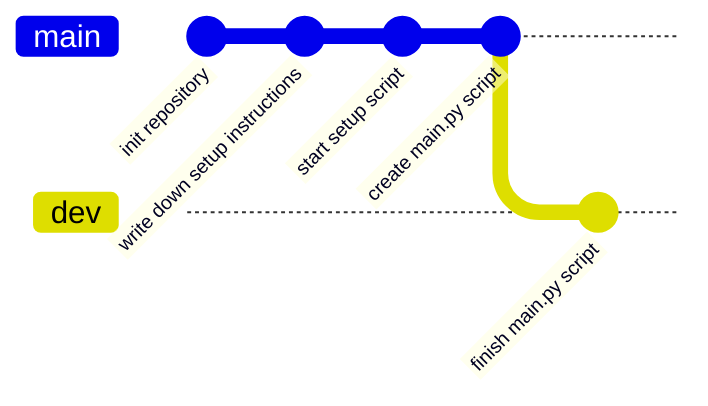
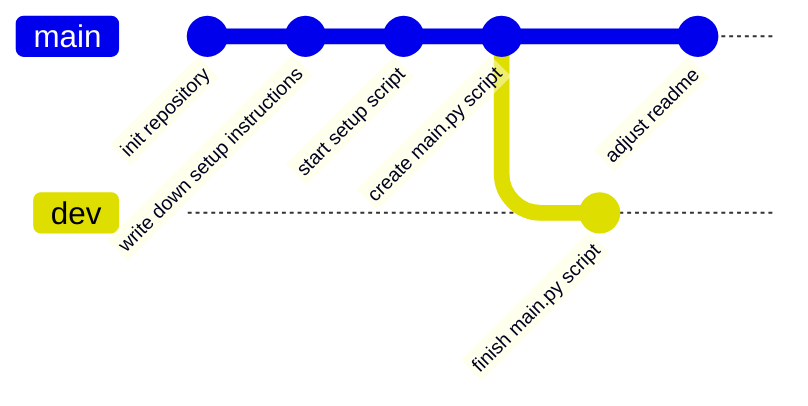

# Branches

Branches are a way to organize simultaneous work in the same repository. Branches are just pointers into the DAG we have
explored earlier, but in contrast to tags always point to a leaf and are automatically advanced.

[//]: # (TODO: command)

## Divergent History

[//]: # (TODO)

[//]: # (TODO: example where we first create a new branch (pointer))
[//]: # (TODO: then we create a divergent history)

### Merging Divergent Histories

## Graphs and Pointers

The previous example talked about how we can visualize the whole commit history of snapshots as a graph, branches are
pointers into that graph.

## Naming Conventions

## Example

[//]: # (TODO: mermaid breaks down here)



1. Alice creates a new branch: `dev`



2. Alice creates a new commit on branch dev: "finish main.py script"



3. Alice switches over to the main branch to adjust the readme



```admonish info title="Task"

Bob now wants to create a new feature, based on the `dev` branch called `feature/fancy`, 
Alice **then** commits a new change onto the `dev` branch called "create example", 
Bob **then** adds a commit to his branch titled: "add color to main.py".

How does the resulting graph look like?
```

## Resources

- [Git Documentation](https://git-scm.com/book/en/v2/Git-Branching-Branches-in-a-Nutshell#divergent_history)
