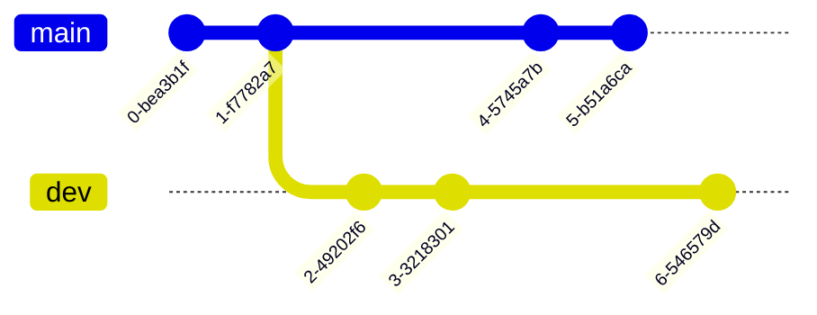
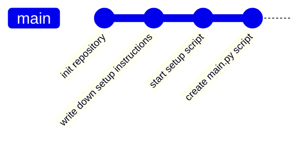
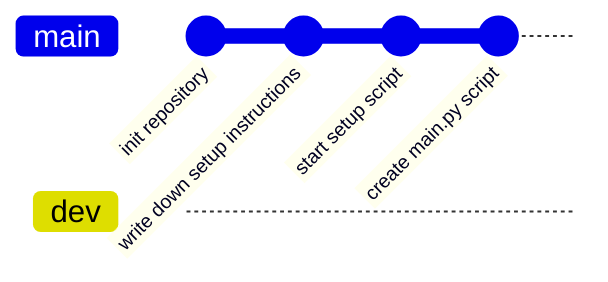
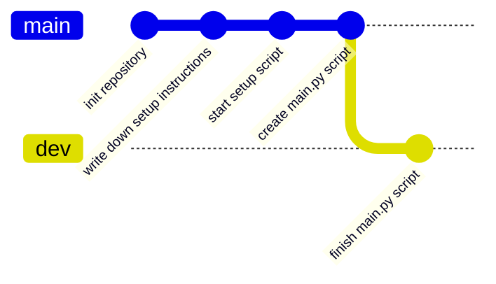
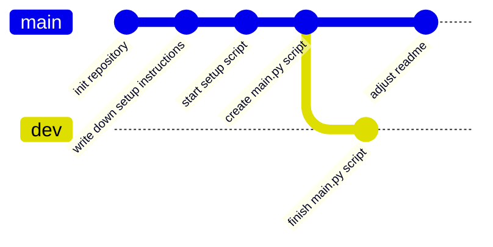
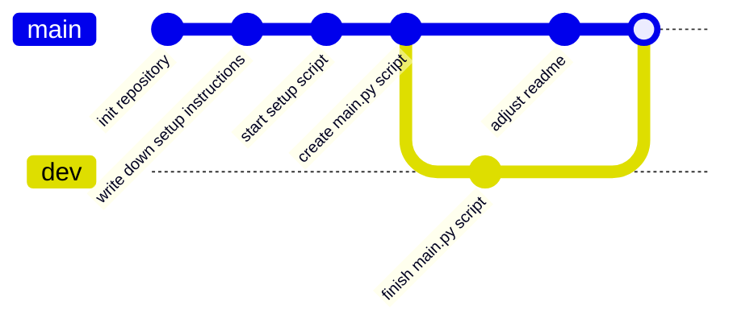
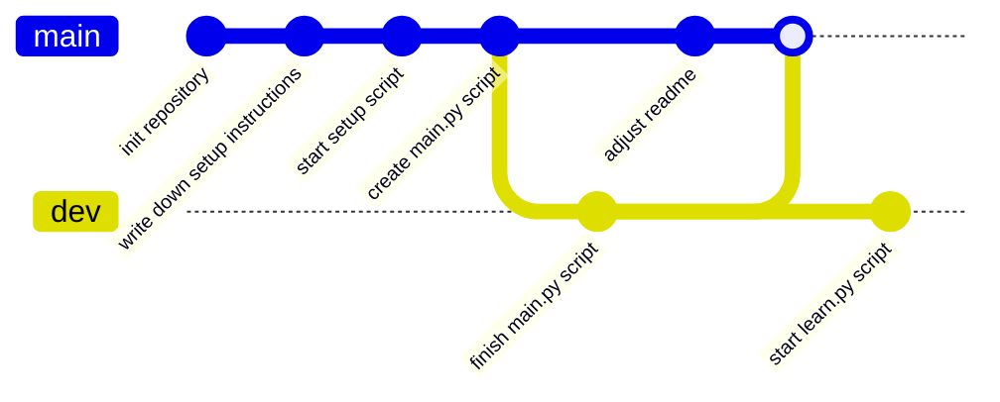

# Branches

Branches are a way to organize simultaneous work in the same repository. Branches are just pointers into the DAG we have
explored earlier, but in contrast to tags always point to a leaf and are automatically advanced.

Branches are often used to separate different features/areas of work that are unrelated to each other.

```admonish example

You are part of a software project and want to develop a new feature called `x`, 
you start a new branch called `feature/x` and develop there.

Meanwhile a critical bug has been detected, but the new feature `x` isn't ready yet. 
You can now branch of `main` with a new branch: `fix/critical-bug`, fix the bug, and merge it into `main`, 
without needing to deploy the unfinished (and broken) feature you are working on.

```

Branches are also used to enable simultanous collaborative work on different features, without needing to interfere with
one another.

## Graphs and Pointers

The previous chapter talked about how we can visualize the whole commit history of snapshots as a graph, branches are
pointers into that graph.

## Divergent History

When we create a new branch we "point" to the same commit we currently look at (`HEAD`). Only once we commit a change we
create a diverging history and our "pointer" (branch) moves forward, while the original branch we branched out from does
not. The changes between those branches are isolated from each other and you are able to freely switch between them.



[//]: # (TODO: example where we first create a new branch - pointer)

[//]: # (TODO: then we create a divergent history)

### Merging Divergent Histories

Once you have developed your features/requirements you likely want to merge these changes back together. This is where
the concept of **merging** comes into play. Conceptually merging takes the state of the target branch and the current
branch and merges them together, changes of the target branch are applied to the current branch, resulting in a new
commit, unifying both branches, if both branches touched the same section of code conflict resolution must take place,
the chapter [merge] goes into greater detail, but of the time these can be applied automatically.


## Example

[//]: # (TODO: mermaid breaks down here)



1. Alice creates a new branch: `dev`



2. Alice creates a new commit on branch dev: "finish main.py script"



3. Alice switches over to the main branch to adjust the readme



4. Alice wants to merge the changes done in dev into main



5. Alice continues development and creates a `learn.py` script in the `dev` branch



```admonish info title="Task"

Bob now wants to create a new feature, based on the `dev` branch called `feature/fancy`, 
Alice **then** commits a new change onto the `dev` branch called "create example", 
Bob **then** adds a commit to his branch titled: "add color to main.py".

How does the resulting graph look like?
```


## Resources

- [Git Documentation](https://git-scm.com/book/en/v2/Git-Branching-Branches-in-a-Nutshell)
