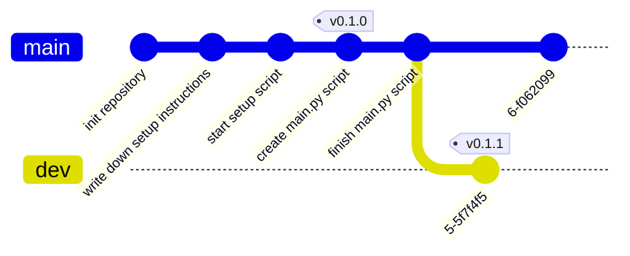

# Tags

git supports the ability to tag individual commits in a repositories history as being important. This tags are markers
into the graph (explained in the [previous chapter](00-branches.md)), the difference between a branch and a tag is that
a branch moves with the newest commit, while a tag only every points to a single commit and never advances in the
history.

Tags are most commonly used in to tag specific releases of a software, this enables users to easily navigate to the
state of the repository at the time of the release, inspecting relevant documentation etc.

## A Detour - Semantic Versioning

Tags are often used for marking specific release points (the commit where version `v1.0.0` was released, etc.), the most
commonly used versioning scheme is [Semantic Versioning](https://semver.org/), sometimes better known as semver.

Semantic versioning says that a specific version should be of the format: `MAJOR.MINOR.PATCH`, where you increment:

* `MAJOR` when you make an incompatible API change
* `MINOR` when you add functionality in a backwards compatible manner
* `PATCH` when you make backwards compatible bug fixes

The `MAJOR` version is special and indicates an unstable release

On a git tag you usually prefix the version with a `v` to make sure people know that it is a specific version, if you
publish more than a single package in a repository most people prefix the package name with `@`,
e.g. `error-stack@v0.3.0` where `error-stack` is the name of the package being released.

## Examples


1. Alice creates a new tag: `v0.1.0`


2. Alice creates a new commit: "finish main.py script"

```admonish info title="Task"

How does the resulting graph look like?

```

~~~admonish info collapsible=true title="Solution"

[//]: # (TODO: width is not correct)


~~~

3. Alice creates a new branch `dev` with a new commit

```admonish info title="Task"

How does the resulting graph look like?

```

~~~admonish info collapsible=true title="Solution"

[//]: # (TODO: width is not correct)


~~~

4. Alice creates a new tag on the most recent commit

```admonish info title="Task"

How does the resulting graph look like?

```

~~~admonish info collapsible=true title="Solution"

[//]: # (TODO: width is not correct)


~~~

5. Alice checkouts `main` again and creates a new commit

```admonish info title="Task"

How does the resulting graph look like?

```

~~~admonish info collapsible=true title="Solution"

[//]: # (TODO: width is not correct)



~~~
