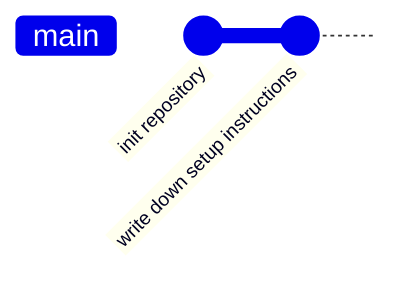
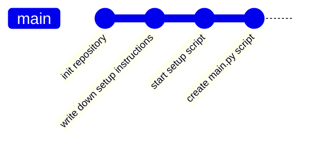

# Theory

`git` is a VCS (version control system) that is based on a DAG (directed acyclic graph).

[//]: # (TODO: explain: what is a DAG)

Every git repository contains a history of commits, which in itself are changes. The changes always (except for the
first commit) have at least a single parent. We can abstract over that fact and assume that the git commit history is a
graph of different nodes that represent changes. This allows us to see which commits have affected later commits and the
path taken to reach a specific commit.

`git` has the ability to display the graph using `git log --graph --decorate --oneline`

```admonish info title="Task"
Execute `git log --graph --decorate --oneline` in your repository of choice.
```

**Why is this important?** Currently we have only looked at linear commit histories, e.g. a single user, commits one
change after another. Often in the real world and collaborative environments, this isn't the case and the next
chapter [Branches](./00-branches.md) will how a git history can branch out into a tree.

## Example

1. Alice creates a new git repository `A`, which is completely empty.
2. Alice creates a new file `README.md` and commits it with the message: `init repository`
3. Alice creates a new file `docs/setup.md` detailing how to setup the repository and commits it with the
   message: `write down setup instructions`



## Task

Alice now creates two new commits:

1. `start setup script`
2. `create main.py script`

```admonish info title="Task"
How does the commit history look like now?
```

~~~admonish info collapsible=true title="Solution"

[//]: # (TODO: width is not correct)



~~~

## Resources
